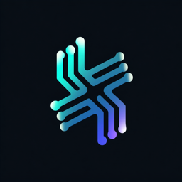
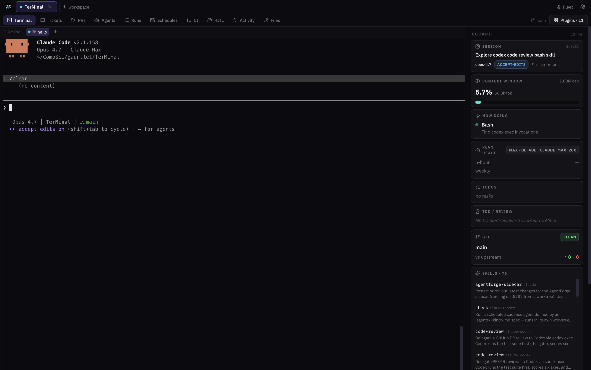
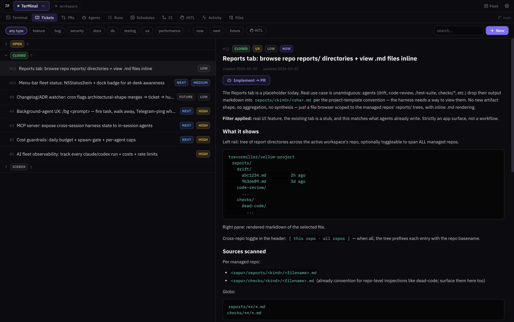
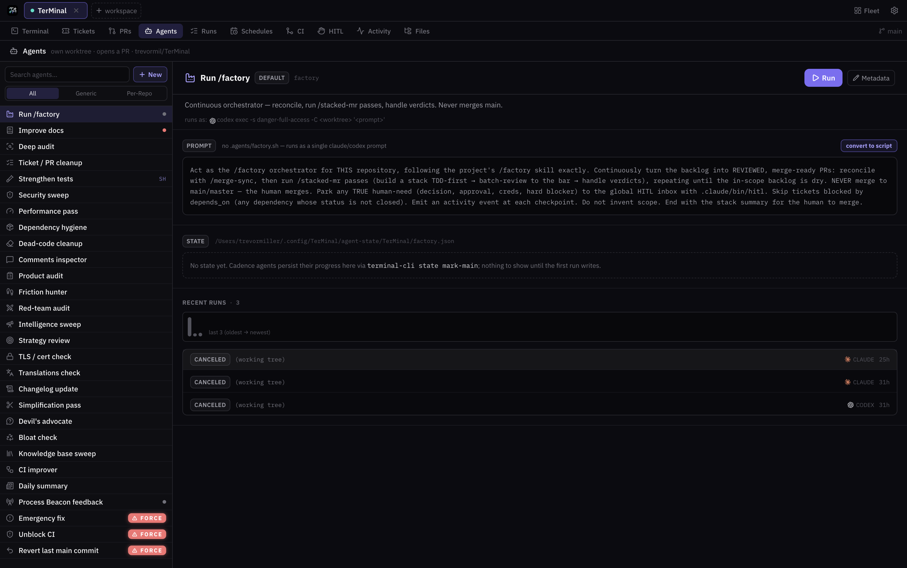
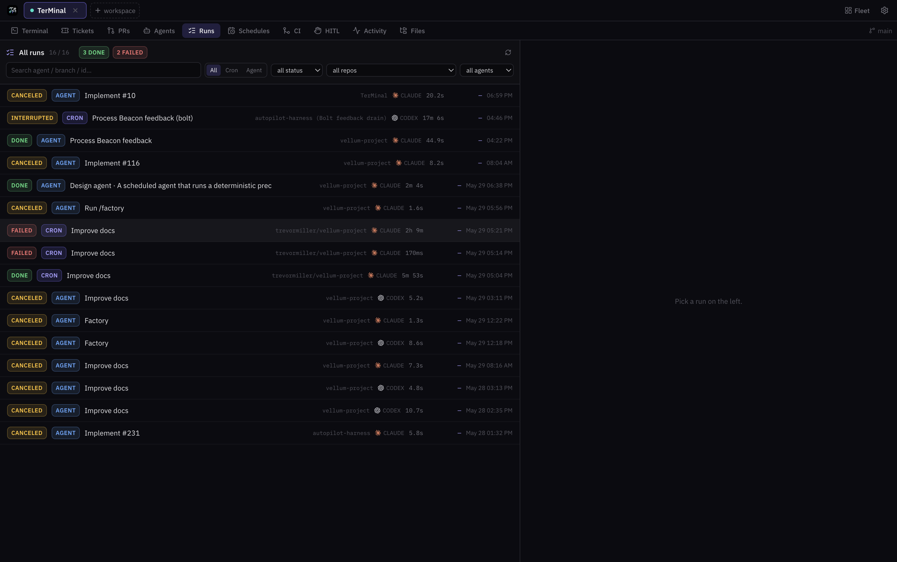
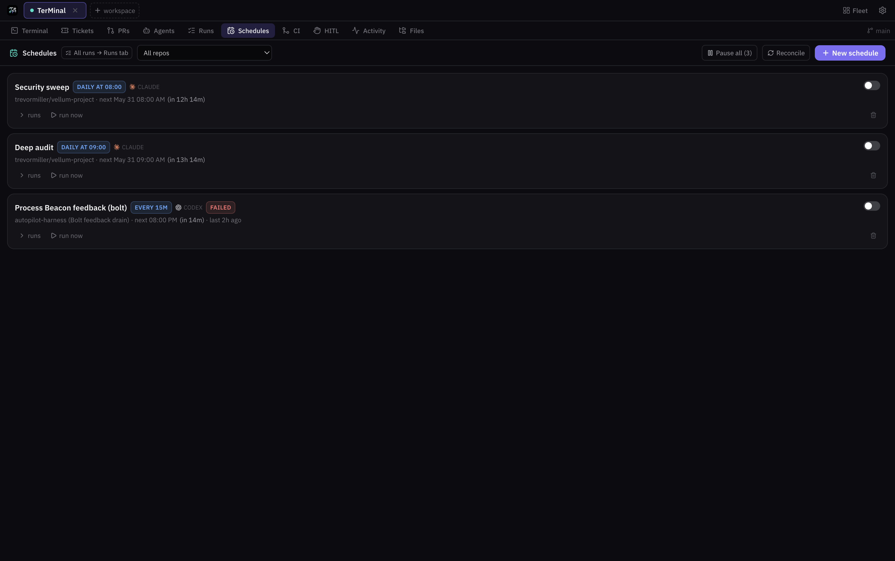

<div align="center">
  
  <h1>TerMinal</h1>
  <p><strong>The terminal, rebuilt for agents that do the work.</strong></p>
</div>

<p align="center">
  
</p>

Your terminal was designed for a human typing one command at a time. Your actual
workload is now five Claude Code sessions, a Codex agent grinding a backlog on a
schedule, and a review pass you'd like to trust — and the terminal shows you a
blinking cursor.

**TerMinal is a macOS app that hosts the real agent CLIs** —
[Claude Code](https://claude.com/claude-code),
[Codex](https://github.com/openai/codex), Cursor Agent, plus OpenRouter and
Hermes harnesses for everything else — **and wraps them in the management layer
an agent workforce needs**: a backlog agents own, schedules that fire
with the app closed, a review surface for every PR, a cost ledger for every run,
and one inbox for the moments that genuinely need a human.

One rule holds the whole thing together: **agents never merge**. They design,
ticket, branch, implement, open the PR, and stop. The merge to `main` is yours,
every time.

**And it's local-first, all the way down.** No server, no account, no telemetry.
Sessions run on *your* `claude`/`gh`/`glab` auth. Every artifact — activity
feed, run logs, schedules, review results, the HITL inbox — is a file on your
machine that renders offline.

> macOS-first ([why](docs/decisions/0003-macos-primary-platform.md)).
> Open source, MIT.

---

## Screenshots

<table>
  <tr>
    <td></td>
    <td></td>
  </tr>
  <tr>
    <td></td>
    <td></td>
  </tr>
</table>

## What you get

### A real terminal, multiplied

- **Real CLIs, real PTYs.** Each session runs the actual engine binary in its
  own pseudo-terminal (the same xterm.js + node-pty pattern as VS Code's
  terminal). Nothing is reimplemented or proxied; resume uses each engine's
  native resume.
- **Workspaces as tabs.** Repos across the top, sessions within each, split and
  4-up grid layouts across repos, ⌘K palette to jump anywhere. Terminals stay
  mounted when you switch tabs — a session never drops.
- **A cockpit per session.** A sidebar of live, per-session telemetry: context
  window %, token burn, your plan's 5-hour/weekly usage (a live `/usage`
  mirror), what the agent is doing right now, its todo list, git state, and the
  latest TDD/code-review verdict. Every number describes one session, never an
  aggregate.
- **Five engines, one launcher.** Claude, Codex, and Cursor run interactive
  sessions and agent jobs; OpenRouter and Hermes run agent jobs on any model
  slug — with a curated menu, per-run cost capture, and your API key sealed in
  the OS keychain.

### A software factory around it

- **Tickets** agents can own. Markdown backlog by default; GitHub Issues,
  Linear, or a private per-repo **Obsidian vault** as drop-in providers; team
  boards embed read-only. Every ticket has an owner agent, acceptance criteria,
  and links to the runs and PRs it produced.
- **Agents** are the unit of work — a roster of classic (prompt/script) and
  persistent (memory-backed) agents with model policy, deterministic checks,
  optional LLM judges, and per-repo overrides in `.agents/`. Code-changing runs
  get an isolated git worktree; nothing touches your checkout.
- **One ledger for runs.** In-process, scheduled, background, and
  terminal-launched runs normalize into a single view: live log, lineage back
  to the ticket and PR, evaluation results, dollar cost, rerun/cancel.
- **Schedules** that outlive the app. Local schedules are real launchd jobs
  (a headless runner ships in the bundle); schedules can also target always-on
  Linux hosts over SSH — systemd timers or k8s CronJobs — so the factory keeps
  running when your laptop doesn't. A failed run files itself to the inbox.
- **PR/MR review** built in. `gh`/`glab` auto-detected per repo, full diff
  viewer (unified/split, per-file viewed-state), review findings and
  suggestions, forge CI status, and a merge button that is deliberately the
  only one in the app.
- **Loops** for goal convergence. Pair a driver session that writes a gradable
  contract and adversarially grades, with a worker session implementing in a
  worktree — or run single-session mode where fresh evaluators grade a
  long-lived generator. The generator never grades itself.
- **Observability** you can act on. Cross-repo throughput, cycle time
  (ticket-filed → PR-merged with stage splits and a funnel), success rates, an
  AI-spend explorer down to per-request payloads, and a `/factory` orchestrator
  that works the backlog until it's dry.

### A human gate that actually gates

- **One inbox for everything human.** Approvals, credentials, decisions, hard
  blockers — agents file items to a global HITL inbox from any repo, each pings
  Telegram, and the app badges the count until you resolve it.
- **AFK control from your phone.** The Telegram bridge is two-way: `/feature
  <idea>` drafts a ticket and offers a start-work button; `/runs`, `/tail`,
  `/hitl`, `/cancel` and friends steer the factory while you're away.
- **Merges stay yours.** Agents stop at "PR open" by design, and the tooling
  itself enforces it — a prompt can't talk an agent past the gate.

## Quick start

Requires [bun](https://bun.sh) and at least one engine CLI on your `PATH`
(`claude` or `codex`).

```bash
git clone https://github.com/trevormil/TerMinal.git
cd TerMinal
git submodule update --init   # optional: vendored references (vendor/)
bun install                   # also rebuilds node-pty against Electron's ABI
bun run dev
```

First launch is a two-step setup: step one probes your machine (which of
`claude`/`codex`/`cursor`/`gh`/`glab` are installed and authenticated), confirms
your projects folder, and lets you pick a default agent engine; step two offers
the optional connections — Telegram, the MCP server, the activity hook, an
OpenRouter key. Everything has a working default and both steps are skippable.
A one-time orientation screen then maps the tabs, and each repo gets its own
orientation on first open.

From the session picker: resume an existing session, start a new one in any
folder, scaffold a **new project from the template**, or launch a **paired
loop**. `gh` and `glab` are optional — they light up the forge features that
use them.

> **Platform: macOS (Apple Silicon).** Packaging, launchd scheduling, and the
> editor/browser handoffs assume macOS. Dev works on Linux minus local
> schedules (use remote hosts). Rationale and a port checklist:
> [ADR-0003](docs/decisions/0003-macos-primary-platform.md).

### Install it as a real app

```bash
bun run dist        # → dist/TerMinal-<ver>-arm64.dmg + dist/mac-arm64/TerMinal.app
codesign --force --deep --sign - "dist/mac-arm64/TerMinal.app"
cp -R "dist/mac-arm64/TerMinal.app" /Applications/
open "/Applications/TerMinal.app"   # right-click → Open the first time
```

Details: [`docs/runbooks/build-and-release.md`](docs/runbooks/build-and-release.md).

## How a feature ships

The loop TerMinal is built to run, end to end:

1. **File it.** A ticket lands in the repo's backlog — typed in the Tickets
   tab, filed by an agent, or texted in via Telegram `/feature`. It gets an
   owner agent and acceptance criteria.
2. **An agent picks it up.** On demand, on a schedule, or via the `/factory`
   orchestrator. The run gets its own git worktree and branch; the run record
   starts streaming into Runs.
3. **TDD-first implementation** (the [project-template](#project-template)
   workflow): failing test → code → suite green → push → PR opened with the
   ticket linked.
4. **Review to a bar.** A code-review agent scores the diff and writes findings
   into the repo's `.reviews/`; the MRs/PRs tab renders verdict, findings, and
   the diff side by side. Deterministic checks and optional judges run per the
   owning agent's contract.
5. **You merge.** The one step no agent performs. Post-merge, ticket state
   reconciles automatically and cycle-time metrics update.

Anything that stalls — a credential, an approval, a failed scheduled run —
files itself to the inbox and pings your phone instead of dying silently in a
log.

## The surfaces

Tabs are repo-aware and curated: the defaults stay focused, the rest enable in
Settings → Tabs.

| Surface | What it's for |
| --- | --- |
| **Terminal** | The engine CLI plus the per-session cockpit. |
| **Tickets** | Browse/filter/create; inline status edits write back to markdown. Provider per repo: local, GitHub, Linear, Obsidian. |
| **MRs / PRs** | Live forge requests with diff, findings, CI state, and the merge button. |
| **Agents** | The roster: definitions, model policy, contracts, run history, one-click ticket implementation. |
| **Runs** | Every run with log, lineage, evaluation, and cost. |
| **Schedules** | launchd/systemd/k8s-backed cadence with run history and a reconcile that surfaces dark jobs. |
| **Factory** | The orchestrator toggle plus cross-repo health: throughput, cycle time, failures. |
| **Observability** | The AI-spend and trace explorer — every request, priced. |
| **CI / Browser / Files / Notes** | Forge CI page, embedded webview, a CodeMirror editor with project search, autosaving markdown notes. |
| **Inbox** (top-right) | The global HITL queue, badge always visible. |

Secondary surfaces (Activity feed, Docs, Reports, Sessions, Help, custom
Panels) are one toggle away.

## Extending it

Everything user-facing is a folder or a JSON file — no plugin API to learn
beyond one object shape.

**A cockpit widget** is a folder under `src/renderer/src/plugins/<id>/`:

```tsx
import { Brain } from 'lucide-react'
import { Card, Big, Gauge } from '../../components/ui'
import type { Plugin, TranscriptStats } from '../../lib/types'

const plugin: Plugin<TranscriptStats> = {
  id: 'context',
  title: 'Context Window',
  icon: Brain,
  intervalMs: 2000,
  defaultEnabled: true,
  realtime: true, // also refresh the instant the transcript changes
  poll: (gt) => gt.transcript(),
  render: (d) =>
    d?.ok ? (
      <Card icon={Brain} title="Context Window">
        <Big value={`${d.contextPct.toFixed(1)}%`} />
        <Gauge pct={d.contextPct} />
      </Card>
    ) : null,
}
export default plugin
```

**A tab** is the same idea:
`src/renderer/src/tabs/<id>/index.tsx` exporting
`{ id, title, icon, order, appliesTo(ctx), Component }`. `appliesTo` gates it
per repo; an optional `badge(gt)` paints a live count.

**A command widget** needs no code at all — global
(`~/.config/TerMinal/widgets.json`) or per-repo
(`<repo>/.TerMinal/widgets.json`):

```json
[
  {
    "id": "uncommitted",
    "title": "Uncommitted",
    "command": "git status --porcelain | wc -l | tr -d ' '",
    "intervalMs": 4000,
    "mode": "big"
  }
]
```

> **Trust:** command widgets run shell commands, and per-repo widgets come from
> the repo you attach to — only attach to repos you trust (same model as
> running their npm scripts).

Agents integrate from the outside too: an **MCP server** (installable from
Settings or onboarding) gives any Claude Code/Codex session cross-session views
— tickets, runs, HITL, activity — and the append-only stores under
`~/.config/TerMinal/` mean a CI job or shell script can join the activity feed
by appending a line.

## <a name="project-template"></a>New projects, ready-made workflow

TerMinal ships its project template embedded at `templates/project-template`
— a scaffold carrying the whole workflow: sessions → tickets → branches → PRs
→ review → human merge, with the TDD gate, in-repo `.reviews/`, cadence
checks, and the schemas these tabs read. It versions with the app itself (one
repo, one history).

- **From the picker:** "New project from template" — name it, pick a parent,
  Create. Fresh directory, `git init`, first commit, session opened, per-repo
  orientation shown. Ticket-provider choices (including the Obsidian vault
  path): [`docs/runbooks/new-project.md`](docs/runbooks/new-project.md).
- **From the shell:** `bin/new-project my-app [parent-dir]`.

Existing repos adopt the same workflow via the in-app Bootstrap banner (or the
per-repo orientation's Setup row) — existing files are never overwritten.

## Setup & settings

The gear icon covers the rest, saved to `~/.config/TerMinal/settings.json`:
projects/worktrees paths, engine paths + default engine, forge preference,
Telegram, ticket providers, remote SSH hosts, appearance, tab visibility. The
full walkthrough — GitHub vs GitLab, global skills, Telegram, the
activity-feed contract — is [`docs/setup.md`](docs/setup.md).

| env var | default | what it does |
| --- | --- | --- |
| `GT_CLAUDE_BIN` | `claude` | Claude binary to launch (Settings → Engines also sets this) |
| `GT_CONTEXT_LIMIT` | auto | context-window cap; auto = 200k, bumps to 1M past 200k tokens |

## How it works

Electron in three layers: **main** owns PTYs, filesystem, and CLI calls;
**preload** exposes one typed `gt` bridge; the **renderer** is React 19 +
Tailwind v4. Cockpit data comes from the session's own transcript on disk; plan
usage mirrors the `/usage` endpoint with the OAuth token Claude Code already
stores in your keychain; review state reads in-repo `.reviews/` artifacts.
Scheduling routes per schedule to launchd (local), systemd, or k8s (remote
hosts). The full map, including the loop engine and the multi-session model:
[`docs/architecture.md`](docs/architecture.md).

```
src/main/            Electron main: PTY spawn, IPC, all fs/CLI readers
src/preload/         the typed `gt` bridge (contextBridge)
src/renderer/src/
  App.tsx            multi-session shell (workspace tab bar)
  SessionView.tsx    one session: terminal + cockpit + tabs
  plugins/<id>/      one folder = one cockpit widget (auto-discovered)
  tabs/<id>/         one folder = one full-screen tab (auto-discovered)
bin/                 headless runners: terminal-cron, terminal-cli, MCP server, or-agent tier
templates/           project-template (embedded workflow scaffold)
```

## Landing page

Static HTML in `landing/`, deployed to GitHub Pages from `main`
(`.github/workflows/pages.yml`). Update `landing/index.html`, push, done.

## Contributing

It's just code — fork it, drop a plugin or tab folder in, send a PR.
`bun run test` runs the suite; `bunx tsc --noEmit` is the type gate; CI runs
both. Merges to `main` are human-only here too.

## License

[MIT](LICENSE) © Trevor Miller
